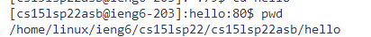

<h1 align = "center">
   Week 2 Lab Report
</h1>

<h2 align = "center">
    Introduction
</h2>

 Hello everyone, This is a tutorial of how to log into a course-specific account on ieng6.

<h3 align = "center">
     Installing Visual studio code
    </h3>

    Vs code is a useful tool for CSE 15L, and here is how you get it.

*  Click on [this Link](https://code.visualstudio.com/download) to download vs code. The link should bring you to this page.
 Download the package corresponds to your computer system and install it.

<h4 align = "center">
    Remotely Connecting
</h4>

*  After you have successfully install vs code, open it, hover to extensions , search and install remote-ssh 

*  Then, hover to "Terminal" -> new terminal.

*  In terminal type ssh cs15lsp22+(course quarter)+3 unique letters @ieng6.ucsd.edu  in your terminal.
    
    *  Ps: your cs15l(course quarter) username will have 3 unique letters after 22, make sure you know yours.

*  After you entered your email, it will ask you to enter your password.

    *  Ps: for security reason, it would not show anything when you are typing your password, so just type it and press enter.

*  After you have done all steps above, you should see  This mean you are successfully remote connected to the your lab computer.

*  Now you have connected to the lab computer, lets try some commands
    *  ls (show normal files in blue)
    
    

    *  mkdir (create a directory or file)

    

     After you done that do ls again to check if you have created successfully or not.

    * cd filename (change directory)

    

    * pwd (check which directory you are currently at)

    

<h5 align = "center">
    Setting an SSH  Key and Moving files with SCP
       
</h5>

* If you are those type of person that doesn't like entering password every single time, then this is designed for you.

* First, do ctrl + d for disconnect from the remote computer.

* Then, enter  ssh-keygen in your terminal. It should show something like the picture.

  

* Leave it empty, press enter to continue. Then, it ask you for the passphrase, also leave it empty and press continue.

*  After you done that it will shows this  that mean you have successfully created an empty file that stored your password.

*  Now, you need to login to the remote computer first to create a .ssh file to store your password.

    *  After login, type  mkdir .ssh to create your ssh filder. (user ls -a  to make sure you have created the file)

    *  disconnect

*  In your main computer, type  scp /Users/(your username for your computer)/.ssh/id_rsa.pub (your @ieng.ucsd.edu email):~/.ssh/authorized_keys in your terminal to upload your public keygen file from your computer to the remote computer.

    *  In general, if you are trying upload file from your current file, simply just do scp (name of the file) (ieng6 email):~/ this will upload your file to the main folder, but if you want to upload file to a specific folder, type the exist folder in your remote computer after  ~/.

    *  For exmaple, if I want to upload this file to the "hello" folder, I need to type scp lab-report-1-week-2.md cs15lsp22@ieng6.ucsd.edu:~/hello

       

 Tips

*  When typing command lines in terminal, you can always use tab to autofill codes or file's name.

*  Using the up or down arrow key may help you save some times when your previous command has some errors in it.

    

